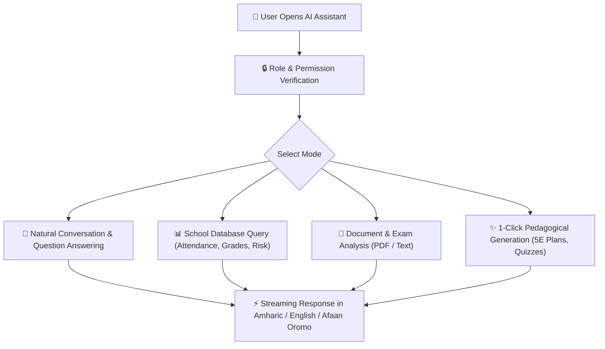

# Interactive AI Assistant & Ecosystem Overview

The **YeneSchool AI Assistant** is an intelligent, context-aware copilot built directly into every screen of the portal. Designed specifically for Ethiopian K-12 education, the AI Assistant connects securely to real-time school records, understands the **Ethiopian Calendar (EC)**, supports **5 languages** (Amharic, Afaan Oromo, Somali, Tigrinya, and English), and adapts its behavior to each user's specific role.



---

## 1. Accessing the AI Assistant

The AI Assistant is accessible from anywhere in the platform:
- **Top Header Bar**: Click the **✨ AI Assistant** icon in the main navigation bar.
- **Keyboard Shortcut**: Press `Cmd + K` (Mac) or `Ctrl + K` (Windows/Linux) and type your question.
- **Contextual Action Buttons**: On specific pages (such as *Lesson Planner*, *Gradebook*, or *Student Profile*), click **✨ Generate with AI** or **Ask AI about this Student** to load context instantly.

---

## 2. Core Capabilities & Interactive Tools

| Capability | How It Works in YeneSchool |
| :--- | :--- |
| **Real-Time School Data Tools** | The AI can safely look up student attendance percentages, grade averages, pending fee invoices, and class rosters without leaving the chat window. |
| **Role-Aware Security Boundaries** | Teachers only access their assigned classes; Parents only access their own children; Directors view school-wide analytics. Super Admin privileges never leak. |
| **Full Multilingual Fluency** | Chat naturally in **Amharic (አማርኛ)**, **Afaan Oromo**, **Somali (Soomaali)**, **Tigrinya (ትግርኛ)**, or **English**. The AI automatically responds in the language you used. |
| **Dual Calendar Intelligence** | Converts dates effortlessly between the Ethiopian Calendar (e.g., *Meskerem 15, 2017*) and the Gregorian Calendar (*September 25, 2024*). |
| **Document & Syllabus Analysis** | Drag and drop Ministry curriculum PDFs, lesson outlines, or past exam papers into the chat for instant summarization, question extraction, or gap analysis. |

---

## 3. Role-Specific Copilot Capabilities & Prompt Library

```
┌───────────────────────────────────────────────────────────────────────────────┐
│ 💬 Example Prompt Template                                                    │
│ "Analyze Grade 9B General Science quiz marks. Which 3 topics had the lowest   │
│ average scores, and generate 5 remedial practice questions in Amharic."       │
└───────────────────────────────────────────────────────────────────────────────┘
```

### 👨‍🏫 For Teachers & Academic Staff
- **5E Lesson Plan Generation**: Generate timed classroom plans based on Ministry textbooks (Engage, Explore, Explain, Elaborate, Evaluate).
- **Quiz & Exam Item Generator**: Create multiple-choice questions with answer keys categorized by Bloom's taxonomy.
- **Constructive Student Feedback**: Draft empathetic, encouraging comments for end-of-term student report cards.
- **Differentiated Instruction**: Adapt a difficult physics or math concept for students needing extra scaffolding.

### 🏫 For School Directors & Administrators
- **Executive Morning Briefing**: Summarize daily school attendance, teacher absences, and urgent operational alerts.
- **Early Warning At-Risk Identification**: Query the top 10 students exhibiting consecutive absenteeism or falling grade trajectories.
- **Official Circular & Announcement Drafting**: Write professional bilingual notices for parents regarding school events, holidays, or fee schedules.

### 👨‍👩‍👧 For Parents & Students
- **Study Copilot & Homework Explainer**: Break down homework questions step-by-step without simply giving away the final answer.
- **Academic Progress Summarizer**: Translate technical exam percentage breakdowns into clear, easy-to-understand progress updates.
- **Excuse Letter Assistant**: Draft formal medical absence notices for homeroom teachers.

---

## 4. Best Practices for High-Quality Prompts

> [!TIP] **Follow the C-T-F Prompting Rule**
> 1. **Context (C)**: Mention the grade, subject, or class (*"For Grade 8 Social Studies, Unit 4..."*).
> 2. **Task (T)**: State clearly what you need (*"Create 3 discussion debate topics..."*).
> 3. **Format (F)**: Specify how you want the output presented (*"Format as a markdown table with suggested time limits and student rubrics."*).

---

## Next Steps in AI Intelligence

- [Autonomous AI Engine & Background Autopilots](/en/ai/autonomous-autopilot) — How background AI monitors risk, absence, and daily briefings
- [Timetable Substitution Watchdog](/en/ai/timetable-watchdog) — Automated absence matching and Telegram period swaps
- [Empathetic Parent Dialogue Engine](/en/ai/parent-empathy-dialogue) — Automated empathetic SMS alerts and family outreach
- [AI Configuration & Model Settings](/en/ai/ai-settings) — Setting up API keys, model tiers, and feature toggles
