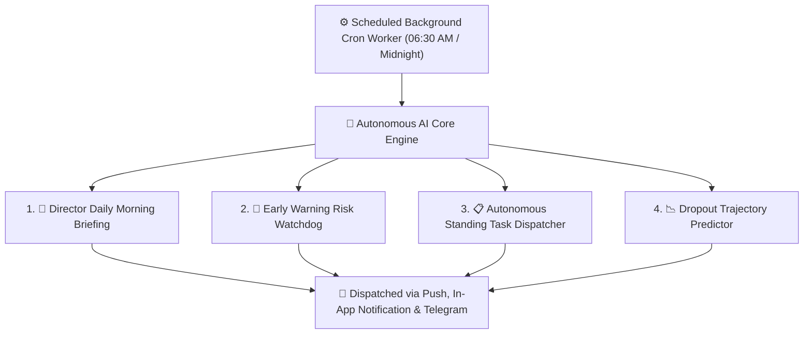

# Autonomous AI Engine & Background Autopilots

Beyond interactive chatbots, YeneSchool features an **Autonomous AI Agent Engine** (`autonomous-ai.service.ts`, `ai-scheduler.service.ts`). Operating silently in the background via scheduled workers, these autonomous AI workers proactively analyze school databases, detect operational bottlenecks, forecast student dropout risks, draft bilingual morning briefings, and alert directors before minor issues escalate into crises.



---

## 1. The Autonomous AI Agent Suite

### 🌅 Agent 1: Director Daily Morning Briefing
Every school morning at **06:30 AM**, the AI scans attendance check-ins, fee collections, exam deadlines, and teacher absence requests to synthesize an executive summary directly on the Director's dashboard:
- **Attendance Watch**: Classes with unusual absence spikes yesterday.
- **Staff Coverage**: Teachers scheduled for leave today and their substitute assignment status.
- **Academic Deadlines**: Pending continuous assessment submissions from department heads.
- **Financial Pulse**: Summary of fee payments collected in the previous 24 hours.

---

### 🚨 Agent 2: Early Warning & Dropout Risk Watchdog
The **Early Warning AI** runs continuously to evaluate every enrolled student against a multi-factor risk scoring model:
- **Attendance Trajectory**: Identifies students with declining attendance trends over consecutive weeks (e.g., dropping below 85%).
- **Academic Score Anomalies**: Detects sudden grade drops across multiple subjects.
- **Discipline & Behavioral Incidents**: Tracks escalating demerit points.
- **Recommended Interventions**: Automatically suggests tailored remedial actions (e.g., *Parent-Teacher conference*, *peer tutoring*, or *counseling referral*).

---

### 📋 Agent 3: Autonomous Standing Tasks
Directors can configure recurring automated monitoring rules using plain language:
- *"Every Friday at 4 PM, review all Grade 9-12 lesson plan completions and flag unsubmitted units to department heads."*
- *"Notify the finance team when more than 15 students in a class have invoices overdue by over 30 days."*

---

## 2. Managing Autonomous AI Autopilots

School Directors can configure and monitor background agents from **Director Portal > School Settings > Autonomous AI**:

```
┌────────────────────────────────────────────────────────────────────────┐
│ 🤖 Autonomous AI Control Center                                       │
├────────────────────────────────────────────────────────────────────────┤
│ [✓] Director Daily Morning Briefing (Cron: 06:30 AM)         [Active]  │
│ [✓] Proactive Early Warning Risk Watchdog                    [Active]  │
│ [✓] Timetable Substitution Auto-Negotiator                   [Active]  │
│ [✓] Midnight Promotion Queue Engine                          [Active]  │
└────────────────────────────────────────────────────────────────────────┘
```

1. **Enable / Disable Agents**: Toggle individual background autopilots without affecting standard system features.
2. **Notification Channels**: Choose where AI briefing alerts are delivered (In-App notification center, Mobile Push, or Telegram Bot).
3. **Audit Log & Transparency**: View the exact AI execution history, data scanned, and generated recommendations in the system audit log.

---

## Next Steps in AI Intelligence

- [Interactive AI Assistant & Copilot](/en/ai/overview) — Real-time chat assistant and 5E lesson generator
- [Timetable Substitution Watchdog](/en/ai/timetable-watchdog) — Automated absence matching and Telegram period swaps
- [Empathetic Parent Dialogue Engine](/en/ai/parent-empathy-dialogue) — Automated empathetic SMS alerts and family outreach
- [AI Configuration & Model Settings](/en/ai/ai-settings) — Setting up API keys and provider models
