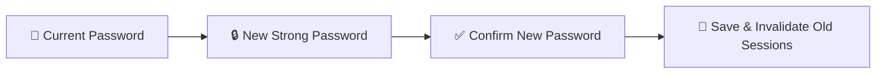

# User Profile, 2FA & Account Security

Every user in YeneSchool — Directors, Teachers, Registrars, Finance Officers, Parents, and Students — has a centralized **My Profile & Security** page (`/profile`). This manual explains how to update your personal details, change passwords securely, configure Two-Factor Authentication (2FA), review active login sessions, and manage connected devices.

---

## 1. Updating Personal Information & Avatar

1. Click on your **User Profile Avatar / Name** in the top-right navbar and select **My Profile** (`/profile`).
2. In the **Personal Details** card:
   - **Profile Picture:** Click the camera icon on your avatar to upload a professional photo (JPG, PNG up to 5MB).
   - **Full Legal Name:** Displayed on transcripts, report cards, and official signatures.
   - **Official Email & Phone Number:** Primary channels for password reset OTPs and urgent system notifications.
   - **Short Biography & Department:** Teaching specialization, grade homeroom, or administrative department.
3. Click **Save Profile Changes**.

---

## 2. Changing Your Password & Security Policies

YeneSchool enforces strict password hygiene to protect student privacy and school financial records:

### Password Requirements:
- Minimum **8 characters** in length (12+ characters recommended for administrative roles).
- Must include at least **one uppercase letter**, **one lowercase letter**, **one numeric digit**, and **one special character** (`!@#$%^&*`).
- Cannot match any of your previous 3 passwords.

### Step-by-Step Password Change:
1. In your Profile, navigate to the **Security & Password** tab.
2. Enter your **Current Password**.
3. Type your **New Password** (the real-time password strength meter will evaluate complexity).
4. Re-enter the new password in **Confirm New Password**.
5. Click **Update Password**.
6. You will receive an immediate confirmation email/SMS confirming the credential update.

---

## 3. Setting Up Two-Factor Authentication (2FA / MFA)

Two-Factor Authentication adds an essential second layer of defense by requiring a 6-digit Time-Based One-Time Password (TOTP) code from your smartphone whenever you log in.

| 2FA Step | Action Required |
| :--- | :--- |
| **Step 1: Install Authenticator** | Download an authenticator app on your smartphone (*Google Authenticator, Microsoft Authenticator, Apple Passwords, or Authy*). |
| **Step 2: Initialize 2FA** | In **Profile → Security**, toggle **Enable Two-Factor Authentication**. |
| **Step 3: Scan QR Code** | Open your authenticator app, tap **Scan QR Code**, and scan the QR displayed on your screen. *(If your camera is unavailable, manually enter the provided 32-character secret key).* |
| **Step 4: Verify OTP Code** | Enter the 6-digit code currently shown in your authenticator app to confirm proper synchronization. |
| **Step 5: Save Backup Codes** | The system generates **10 single-use Backup Recovery Codes**. Copy and store them in a secure location (e.g., password manager). If you lose your phone, these codes are your only self-service recovery option. |

> [!IMPORTANT]
> School Directors, Super Admins, and Finance Officers are strongly recommended to mandate 2FA across their accounts to prevent unauthorized access to sensitive financial records and student personal data.

---

## 4. Active Sessions & Remote Device Sign-Out

To protect against compromised credentials or forgotten logins on public school computers:

1. Scroll down to the **Active Devices & Sessions** panel in your security settings.
2. The list displays every active browser and mobile app session:
   - **Device Type:** (e.g., *Windows Laptop — Chrome Browser*, *Android Phone — Mobile PWA*).
   - **IP Address & Location:** Approximate network origin.
   - **Last Active Timestamp:** Real-time activity indicator.
   - **Current Session Badge:** Identifies the device you are currently operating.
3. If you notice an unrecognized device or forgot to log out of a shared staff room PC, click **Revoke Session** next to that device, or click **Log Out of All Other Devices** to instantly terminate all remote tokens.

---

## 5. Connecting Telegram for Instant Push Notifications

1. In the **Telegram Integration** card, click **Connect Telegram Account**.
2. Click the provided direct deep link (`https://t.me/YeneSchoolBot?start=YOUR_TOKEN`) or scan the QR code with your mobile Telegram app.
3. Send `/start` to the bot.
4. Toggle desired alert categories:
   - **Emergency Announcements:** Immediate school-wide broadcasts.
   - **Attendance Alerts:** Live notices when a child is marked absent.
   - **Grade Postings:** Alerts when exam results or continuous marks are entered.
   - **Fee Payment Confirmations:** Digital receipts and balance summaries.

---

## Next Steps & Related Guides

- [Platform Settings & Branding](/en/director/school-settings) — Configuring school-wide login defaults.
- [Notification Gateways](/en/platform/notifications) — Configuring SMS, Telegram, and Push channels.
- [Reporting Issues & Contacting Support](/en/guides/support-error-reporting) — Submitting support tickets.
