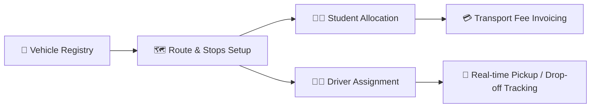

# Transport & Fleet Management

The YeneSchool Transport Module empowers school directors and administrative officers to manage school vehicles, define daily commuting routes, map pickup and drop-off stops, assign students and drivers, and track transportation finances.

---

## 1. Vehicle Registration & Fleet Tracking

Every vehicle in the school fleet must be registered with its technical specifications, capacity constraints, and compliance documentation.

### How to Register a Vehicle
1. Navigate to **School Operations > Transport > Vehicles**.
2. Click **+ Add Vehicle** in the top-right header.
3. Provide the vehicle profile details:
   - **Vehicle Plate / Registration Number**: Unique license plate (e.g., `ET-AA-3-98421`).
   - **Vehicle Model & Make**: (e.g., *Toyota Coaster 30-Seater*, *Isuzu NPR 45-Seater*).
   - **Total Passenger Capacity**: Maximum legal seating count (e.g., `32`).
   - **Vehicle Status**: `Active`, `Under Maintenance`, or `Decommissioned`.
   - **Fuel Type & Mileage Tracking**: Diesel/Petrol and current odometer reading.
   - **Insurance & Inspection Renewal Dates**: Set automated expiration reminder alerts.
4. Click **Save Vehicle Profile**.

> [!NOTE]
> The system prevents over-allocating students past the vehicle's defined passenger capacity limit. If a route reaches 100% capacity, YeneSchool flags the route with a yellow capacity warning.

---

## 2. Setting Up Commute Routes & Bus Stops

Routes organize the geographic path taken by school buses in the morning (pickup) and afternoon (drop-off).

### Steps to Create a Route & Sequence Stops
1. Go to **Transport > Routes & Stops**.
2. Click **+ Create Route** (e.g., *Route 04 — Bole Medhanialem to CMC Roundabout*).
3. Assign the designated primary vehicle and backup vehicle.
4. Click **+ Add Stop** for each scheduled pickup/drop-off point:

| Stop Name | Morning Pickup Time | Afternoon Drop-off Time | Monthly Zone Fare (ETB) |
| :--- | :--- | :--- | :--- |
| **Bole Atlas Junction** | 06:45 AM | 04:15 PM | 1,800 ETB |
| **Edna Mall / Medhanialem** | 07:05 AM | 03:55 PM | 1,800 ETB |
| **Gerji Imperial** | 07:20 AM | 03:40 PM | 2,200 ETB |
| **CMC Michael Square** | 07:35 AM | 03:25 PM | 2,500 ETB |

5. Drag and reorder stops to ensure optimal route sequencing and minimum driving time.
6. Click **Publish Route**.

---

## 3. Student Route Allocation

Students can be assigned to a round-trip commute (both morning and afternoon) or one-way service.

### Allocating a Student to a Bus Route
1. Navigate to **Transport > Student Assignments**.
2. Search for the student by name or Student ID.
3. Select the **Route** and specific **Pickup/Drop-off Stop**.
4. Select **Commute Type**:
   - `Two-Way (Morning & Afternoon)`
   - `Morning Only`
   - `Afternoon Only`
5. Check **Sync with Finance Module**:
   - Automatically attaches the corresponding zone transport fee to the student's monthly fee statement.
6. Click **Confirm Allocation**.

---

## 4. Driver & Bus Attendant Management

1. Go to **Transport > Drivers & Attendants**.
2. Register driver profiles including Driving License Category, emergency contact phone, and background check verification.
3. Assign a **Primary Driver** and **Bus Attendant (Conductor)** per vehicle.
4. Drivers and attendants can use the YeneSchool Mobile App to view their morning manifest, mark student boardings, and alert parents when approaching stops.

---

## 5. Transport Attendance & Parent Push Notifications

When students board or depart the bus:
- The bus attendant taps the student's name or scans the student's ID card barcode using the mobile app.
- Parents instantly receive an automated SMS / Telegram push notification:
  > *"Selam! Nahom Usman has safely boarded Bus #4 at Bole Atlas Stop at 06:48 AM."*

---

## Next Steps

- [School Events & Calendar Planner](/en/operations/events-calendar) — Schedule term dates, holidays, and meetings
- [Data Quality & Auditing](/en/operations/data-quality-audit) — Audit student records and missing contact details
- [Finance Fee Structures](/en/finance/fee-structures) — Configure recurring transportation fee items
