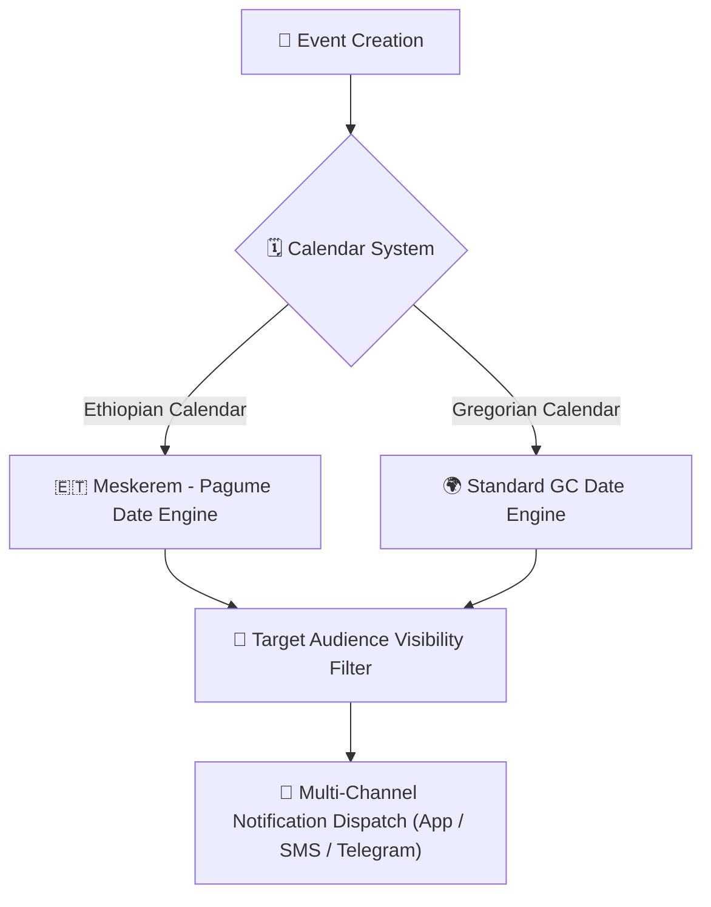

# School Events & Multi-Calendar Planner

YeneSchool features an integrated Multi-Calendar School Event Planner supporting both the **Ethiopian Calendar (EC)** and the **Gregorian Calendar (GC)**. Directors and administrators can broadcast school holidays, sports competitions, parent-teacher conferences, and examination milestones.

---

## 1. Creating a School Event

### Step-by-Step Instructions
1. Navigate to **School Operations > Events & Calendar** (or click the Calendar widget on the Director Dashboard).
2. Click **+ New Event**.
3. Fill in the event parameters:
   - **Event Title**: E.g., *1st Term Parent-Teacher Consultation Day*, *Annual Inter-School Sports Day*.
   - **Category**:
     - `Academic Milestone` (Term Start, Midterms, Final Exam Week)
     - `Public & Religious Holiday` (Enkutatash, Meskel, Eid al-Fitr, Genna, Timket, etc.)
     - `Parent-Teacher Meeting (PTM)`
     - `Extracurricular / Sports / Cultural Day`
     - `Staff Training & In-Service Day`
   - **Date & Time Range**: Set start date/time and end date/time. Dates can be entered in either EC (*e.g., Tikimt 14, 2017*) or GC (*e.g., October 24, 2024*).
   - **Campus Location**: Auditorium, Football Pitch, Main Hall, or Virtual Zoom link.
   - **Audience Visibility**:
     - `Whole School (Public)`
     - `Teachers & Staff Only`
     - `Parents & Guardians Only`
     - `Specific Grade Levels (e.g., Grade 8 & 12 only)`
4. Toggle **Send Event Reminder Notifications** (dispatches 24 hours and 2 hours before the event).
5. Click **Publish Event**.

---

## 2. Ethiopian & Gregorian Dual Calendar Synchronization

YeneSchool's underlying date engine automatically converts between Ethiopian and Gregorian dates:

| Ethiopian Date (EC) | Gregorian Date (GC) | Standard School Event |
| :--- | :--- | :--- |
| **Meskerem 1** | September 11 (or 12 in leap year) | Enkutatash (Ethiopian New Year) |
| **Meskerem 17** | September 27 (or 28 in leap year) | Meskel (Finding of the True Cross) |
| **Tahsas 29** | January 7 | Ethiopian Christmas (Genna) |
| **Tir 11** | January 19 (or 20 in leap year) | Timket (Epiphany) |
| **Yekatit 23** | March 2 | Adwa Victory Memorial Day |
| **Miyazya 27** | May 5 | Patriots' Victory Day |

When a holiday is scheduled, attendance marking for that date is automatically disabled, preventing false absent records.

---

## 3. Parent-Teacher Meeting (PTM) Appointment Booking

For Parent-Teacher Consultation Days:
1. When a PTM event is published, parents receive a notification on their mobile app and web portal.
2. Parents can select a **15-Minute Time Slot** with their child's homeroom or subject teachers.
3. Teachers receive an organized consultation schedule with student performance summaries ready before the meeting.

---

## Next Steps

- [Data Quality & Auditing](/en/operations/data-quality-audit) — Audit system integrity and health metrics
- [AI Timetable & Auto-Assignment Engine](/en/operations/timetable-engine) — Automatically schedule classes and periods
- [Announcements & Messaging](/en/communication/announcements) — Broadcast official school circulars to parents
