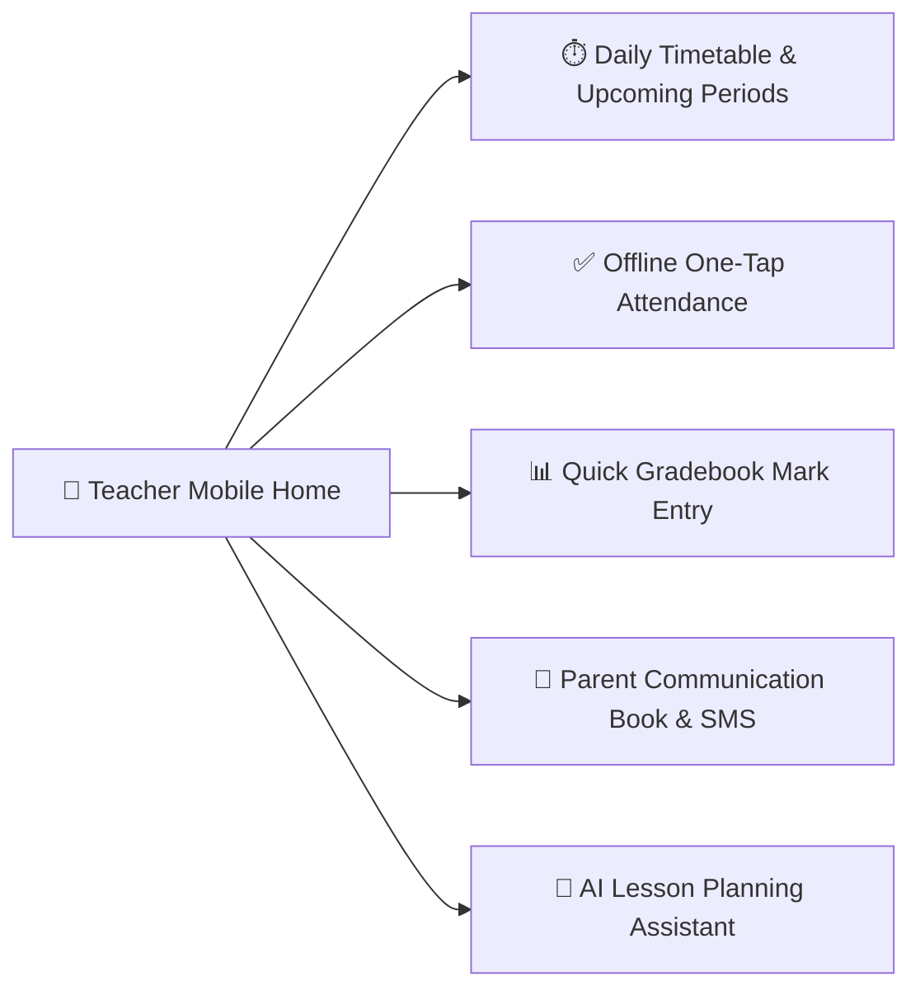

# Teacher Mobile Experience

The YeneSchool Mobile App equips teachers with a fast, lightweight classroom copilot right on their smartphone. Teachers can take daily roll-call in under 30 seconds, enter marks while moving around the room, view their daily timetable, and communicate with parents without sharing their personal phone numbers.

---

## 1. Daily Schedule & Upcoming Periods Widget

When a teacher opens the mobile app:
- The top header highlights the **Current Active Period** with classroom room number, subject, and student count.
- A single tap on **Take Attendance Now** directly launches the roster roll-call for that specific active class.
- The **Today's Schedule** tab displays the full day's period roadmap, break times, and free planning periods.

---

## 2. Taking Attendance on Mobile (Online & Offline)

Teachers can mark classroom attendance using **List Mode** or **Speed Swipe Mode**:

### Roster List Mode
1. Tap the active class (e.g., *Grade 9B — Mathematics*).
2. Tap the status badge next to each student's name:
   - **Green (P)**: Present *(default for all students)*.
   - **Red (A)**: Absent.
   - **Yellow (L)**: Late / Tardy *(prompts for minutes late)*.
   - **Blue (E)**: Excused / Sick Bay.
3. Tap **Mark All Present** for fast batch-marking on high-attendance days.
4. Tap **Submit Attendance**.

> [!TIP]
> **No Internet in Class?** You can take attendance completely offline. The app stores all records in local SQLite storage and automatically uploads them to the school server the moment you connect to Wi-Fi or mobile data.

---

## 3. Fast Continuous Assessment & Gradebook Entry

1. Navigate to the **Gradebook** tab.
2. Select the **Class**, **Subject**, and **Assessment Item** (e.g., *Quiz 2 / 10 marks*).
3. Tap on any student row and enter the score using the custom numeric keypad.
4. The system validates maximum possible points in real-time to prevent accidental entry of invalid scores (e.g., typing 20 on a 10-point quiz).
5. Tap **Save Scores**.

---

## 4. Digital Communication Book & Direct Parent Messaging

Teachers can post class updates, homework reminders, and individual student feedback:
- **Class Broadcast**: Post announcements visible to all parents of that section.
- **Direct Student Note**: Write a private behavioral or academic note to a specific student's parents.
- **Privacy Guaranteed**: The teacher's personal mobile number is never exposed — all communication routes safely through the YeneSchool notification gateway.

---

## Next Steps

- [Parent Mobile Experience](/en/mobile/parent-mobile) — How parents view student progress and receive alerts
- [QR Attendance & ID Scanning](/en/mobile/qr-attendance) — Speed up roll-calls with barcode and QR scanning
- [Mobile Offline Sync Engine](/en/mobile/offline-sync) — How offline SQLite database replication works
