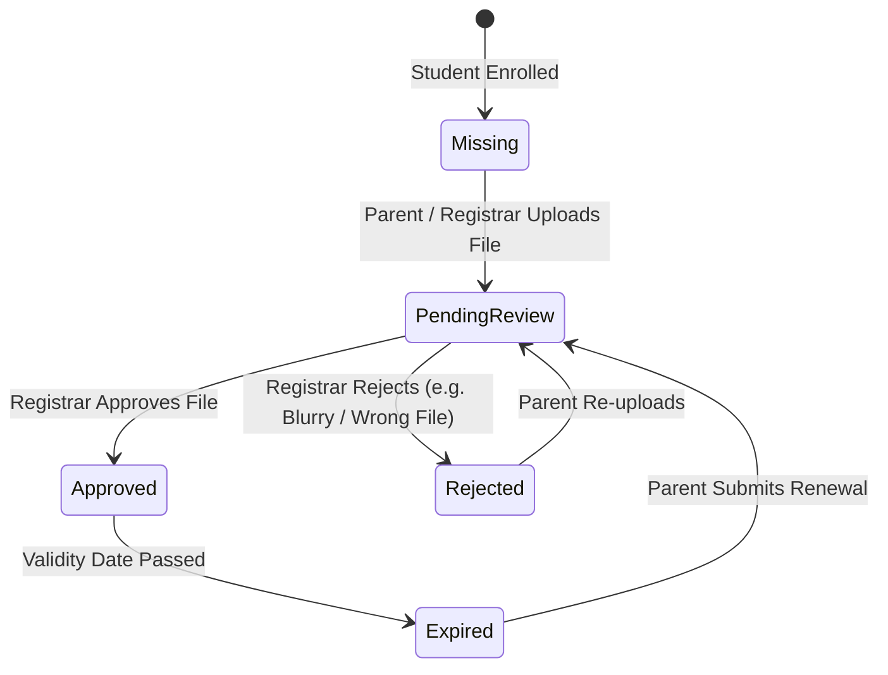

# Documents & Compliance Overview

The **School Documents & Compliance Hub** provides a centralized, secure repository for all institutional policies, regulatory records, and student admission paperwork. It ensures that every enrolled student meets mandatory legal and academic documentation requirements while giving staff and parents instant access to approved school guidelines.

::u-page-grid
:::u-page-card
---
title: Institutional Repository
icon: i-lucide-files
---
Store and organize school bylaws, staff handbooks, curriculum syllabi, and official forms with role-based access control.
:::

:::u-page-card
---
title: Student Compliance
icon: i-lucide-shield-check
---
Track mandatory admission paperwork including birth certificates, immunization cards, transfer certificates, and previous transcripts.
:::

:::u-page-card
---
title: Verification Queue
icon: i-lucide-user-check
---
A streamlined workflow for Registrars to review parent uploads, verify authenticity, and approve or reject submissions with feedback.
:::
::

---

## Document Taxonomy & Categories

All documents uploaded into YeneSchool are organized under standardized categories:

| Category | Typical Documents Included | Default Visibility |
| :--- | :--- | :--- |
| **`POLICIES`** | Staff Handbooks, Student Code of Conduct, Safety & Emergency Plans | Staff Only or Public |
| **`ACADEMIC`** | Curriculum frameworks, syllabus guidelines, national exam schedules | Staff & Students |
| **`FORMS`** | Admission applications, leave request forms, field trip consent slips | Public |
| **`LEGAL`** | Ministry of Education accreditation, school registration certificates | Admin Only |
| **`GENERAL`** | Newsletter archives, term calendars, PTA meeting minutes | Public |

---

## Access Control & Audience Levels

To maintain security and privacy, each document is assigned an **Audience Flag**:

- 🌐 **`PUBLIC`**: Accessible to all logged-in parents, students, teachers, and administrative staff. Ideal for term dates, event schedules, and school codes of conduct.
- 🧑‍🏫 **`STAFF_ONLY`**: Restricted exclusively to Directors, Teachers, Registrars, and Finance Officers. Used for internal staff handbooks and pedagogical guidelines.
- 🔒 **`ADMIN_ONLY`**: Visible strictly to School Directors and Registrars. Reserved for confidential regulatory filings and legal audit paperwork.

---

## Student Compliance Status Lifecycle

Every student enrollment document passes through an automated compliance lifecycle:

---

## Next Steps

- [Student Compliance Verification](/en/documents/student-compliance) — Track required files per student
- [Parent Uploads & Review Queue](/en/documents/parent-submissions) — Review and verify submitted documents
- [Institutional Policies & Handbooks](/en/documents/institutional-policies) — Publish school guidelines and forms
