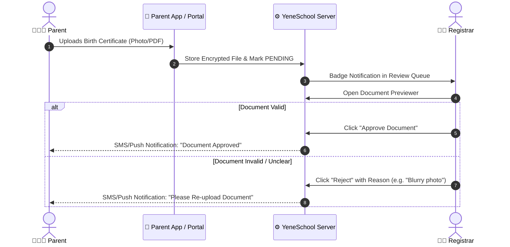

# Parent Uploads & Review Queue

YeneSchool provides a self-service digital submission flow for parents, eliminating long office queues during annual admissions. Parents can photograph or scan required paperwork directly from their smartphone or computer. Registrars then process incoming files through an interactive review queue.

---

## How Parents Upload Documents (Parent Experience)

Parents access the document portal from both the **Web Portal** and the **YeneSchool Mobile App**:

1. Log in to the **Parent Portal** or open the mobile app.
2. Navigate to **My Children** and select the child's profile.
3. Click the **Documents & Compliance** tab.
4. The screen displays all required items with their current status:
   - 🔴 **Action Required**: Missing document needing upload.
   - 🟡 **Under Review**: File received and waiting for Registrar verification.
   - 🟢 **Approved**: File checked and validated by the school.
   - ⚠️ **Rejected**: File returned with feedback notes (e.g. blurry image or expired card).
5. Click **Upload File**, choose the file or snap a clear photo using the phone camera, and click **Submit Document**.

---

## The Registrar Review Queue (`/documents`)

When parents submit paperwork, the file instantly enters the **Pending Review Queue** in the Registrar's workspace:

---

## Step-by-Step: Processing Submissions in the Queue

1. Navigate to **Documents** in the sidebar.
2. Click the **Pending Review** tab. The badge counter indicates how many documents await inspection.
3. Click the **Review (Eye icon)** button on any pending submission to launch the **Document Inspector Modal**:
   - **Full-Screen Preview**: High-resolution zoom for inspecting text, stamps, and signatures.
   - **Student Information**: Student Name, ID, Grade Level, and Guardian Name.
   - **Metadata**: Date submitted, file size, and file type.
4. Choose an action:
   - **Approve**: Confirms the document is valid. The student's checklist updates immediately.
   - **Reject**: Opens a rejection dialog. Select a predefined reason (*Blurry/Illegible*, *Expired Document*, *Wrong Child File*, *Incomplete Pages*) or type custom instructions for the parent.
5. Click **Submit Decision**. The parent is automatically notified via SMS and push notification to log in and review the update.

---

## Automated Notification Triggers

Parents receive automated alerts whenever a registrar acts on their paperwork:

| Action | Notification Triggered | Message Content |
| :--- | :--- | :--- |
| **Approval** | Push Notification + In-app badge | *"The Birth Certificate for [Student Name] has been verified and approved by the Registrar."* |
| **Rejection** | SMS + Push Notification | *"The Birth Certificate for [Student Name] was not approved. Reason: [Registrar Note]. Please upload a clearer copy via the parent portal."* |
| **Document Expiring** | In-app alert (30 days before expiry) | *"Reminder: The medical clearance for [Student Name] expires on [Date]. Please submit an updated copy."* |

---

## Next Steps

- [Student Compliance Verification](/en/documents/student-compliance) — Check overall compliance scores per class
- [Institutional Policies & Handbooks](/en/documents/institutional-policies) — Manage school bylaws and policies
- [Parent Portal Overview](/en/parent/overview) — Guide parents on using portal features
